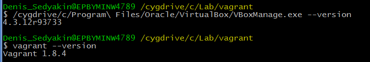
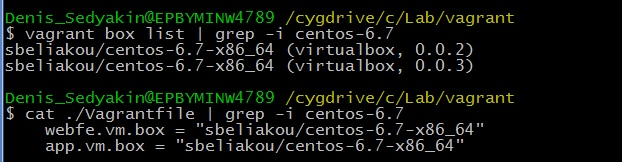
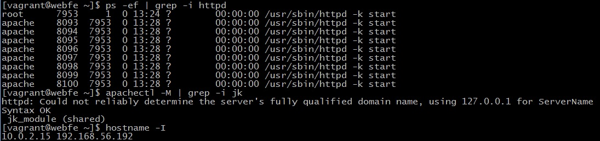
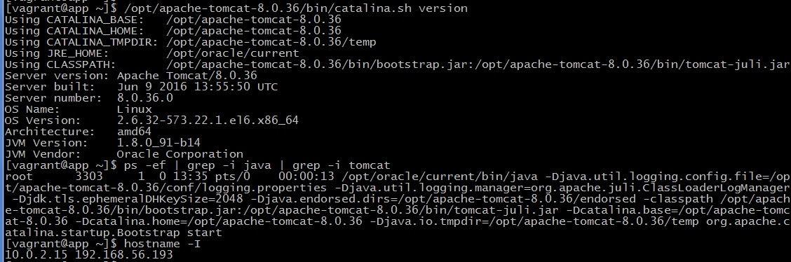
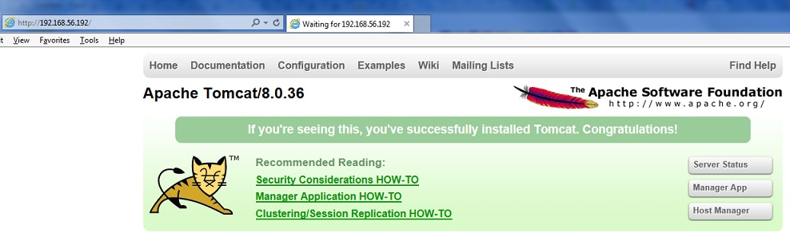

# Task 1. *Vagrant*

1.  Install Virtualbox and Vagrant

2.  Initialize new Vagrant project
3.  Update configuration to use specific vagrant box (sbeliakou/centos-6.7-x86_64)

4.  Configure multiple VM’s in single Vagrantfile (2 VM’s):
  - VM1: httpd, mod_jk installed, configured as web frontend for VM2
  
  - VM2: tomcat 8 (and all needed dependencies) installed
  

5.  Customize VMs’ settings:
  - VM1: 512 MB RAM, 1 CPU
  - VM2: 1 GB RAM, CPU execution cap 35%
6.  Mount host directories into VMs, specify ownerships
7.  Define shell provisioners:
  - default provisioner (performs on both VMs)
  - web.sh script installs and configures httpd and mod_jk (VM1)
  - app.sh script installs and configures tomcat and its dependencies (VM2)

